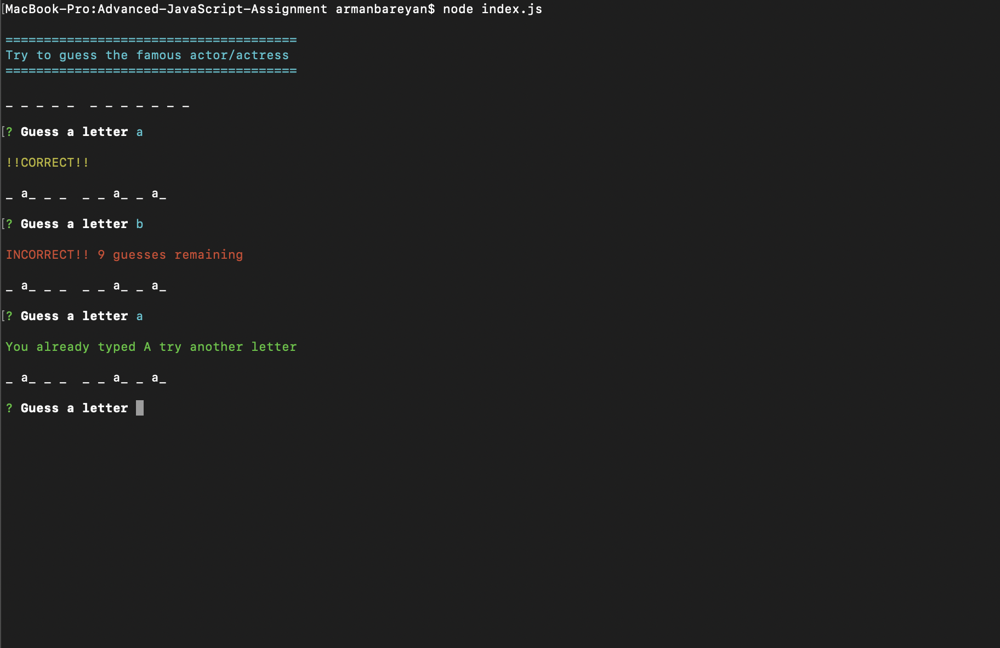

# Advanced-JavaScript-Assignment

## Word Guess

## How to play

* To start the game you must type in terminal "node index.js" and press any key on the keyboard.

* If you guess the letter You can see CORRECT and the letter

* If you don't guess the letter You can see INCORRECT and guesses remaining (You have only 10)

* If you type the letter that you already typed before You can see "You already typed that letter try another letter"

* If you type more than one letter You can see "Please type only ONE letter"

* If you guessed the word you can see "CORRECT" word that you guessed, and the next word

* You win if you guess 5 times in a row

## Built With

* JavaScript
* Node.js
* NPM

## Autor 
* **Arman Bareyan** - [ABareyan](https://github.com/ABareyan)

## License

No license agreements. 

## GOOD LUCK AND HAVING FUN